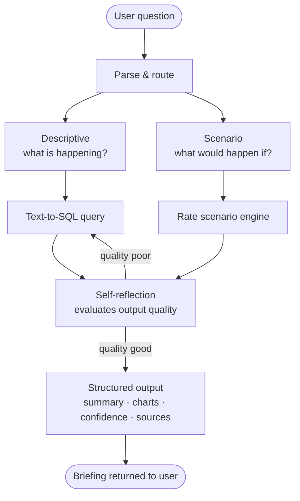

# PortfolioIQ

> AI briefing agent for financial portfolio analysis — answers complex business questions in plain language and returns structured, sourced, visual briefings.

---

## What this is

PortfolioIQ is a multi-step agentic system built on LangGraph and the Anthropic API. It takes a plain-language question about a loan or deposit portfolio, reasons over a structured financial dataset, applies market rate context, and returns a production-grade briefing — with charts, confidence levels, and source attribution.

This is not a chatbot. It is a planning → acting → reflecting → synthesising system.

**Example questions it answers:**

- "What happens to our portfolio if the RBA moves rates up 50bps next quarter?"
- "Show me total term deposits week by week for the last 20 weeks vs prior year"
- "If we give 5bps to the premium segment, what is the estimated volume impact?"
- "Which customer segments are most exposed to rate repricing risk?"

---

## Architecture

**Stack**

| Layer | Technology | Purpose |
|---|---|---|
| Orchestration | LangGraph | Stateful multi-step agent graph |
| LLM | Anthropic API (claude-sonnet) | Reasoning, SQL generation, narrative |
| Data | SQLite + pandas | Structured loan/deposit master dataset |
| Output schema | Pydantic | Validated structured briefing |
| Observability | LangSmith | Full trace, cost, latency per run |
| UI | Streamlit | Live demo interface |

---

## Data layer

All data is public. No proprietary or confidential data is used.

| Source | What it provides |
|---|---|
| APRA MADIS | Aggregate Australian banking statistics — shapes synthetic portfolio |
| RBA API | Full cash rate history, tagged to each portfolio record |
| FRED | Swap rates for forward curve approximation |
| Canstar (public) | Competitor term deposit rates for market positioning context |

The master dataset is synthetic but realistic — generated to match APRA aggregate distributions, with pre-built time dimensions (WoW, MoM, QoQ, YoY, prior year equivalents) and segment flags (premium, standard, SME, retail) baked in.

---

## Two question types

**Descriptive** — what is happening?
Agent queries the portfolio database and returns trend analysis, comparisons, and breakdowns with chart and narrative.

**Scenario** — what would happen if?
Agent applies a rate or pricing delta to the baseline, reasons over segment-level exposure, and returns impact analysis with confidence level and assumptions stated explicitly.

---

## Observability

Every run is traced in LangSmith from day one. Each trace records:

- Cost in USD per node
- Latency in ms per node and end-to-end
- SQL generated and validation result
- Self-reflection score and retry count
- Output quality score (0–10, self-evaluated)

---

## Evaluation

Ground truth eval set of 30 questions written before any code was built. SQL accuracy measured numerically at each phase. Failure modes documented explicitly — not just where it works but where it breaks and why.

---

## Build roadmap

| Phase | Weeks | What ships |
|---|---|---|
| 01 — Data foundation | 1–2 | SQLite master dataset + 30-question eval set |
| 02 — Text-to-SQL | 3–5 | NL → validated SQL with measured accuracy |
| 03 — LangGraph agent | 6–9 | Multi-step agent with routing + reflection loop |
| 04 — Structured output | 10–12 | Pydantic briefing schema with charts + confidence |
| 05 — Streamlit UI | 13–14 | Live demo interface with trace display |
| 06 — Polish + docs | 15–16 | Failure analysis, architecture docs, panel-ready |

---

## Design decisions

**LangGraph over LangChain AgentExecutor**
Explicit graph means every step is debuggable. Cycles enable self-reflection loops. Trade-off: more upfront graph design, no convenience shortcuts.

**SQL validation before execution**
The agent checks its own generated SQL before running it. Silent hallucinations in financial queries are worse than visible failures — the latency cost of validation is worth it.

**Pydantic output schema enforced via tool use**
The LLM cannot return freeform text. Every output is validated against a typed schema at the API level. More reliable than prompt-only JSON.

**SQLite for Phase 1**
Zero cost, zero infrastructure. The data access layer is abstracted so swapping to a production database is one interface change, not a rewrite.

**LangSmith from Phase 3 week 1**
Observability is not a Phase 2 concern. An agent built without tracing accumulates invisible debt.

---

## What this is not

- Not a chatbot wrapper around a single LLM call
- Not a dashboard with AI bolted on
- Not a generic ask-your-data tool
- Not a tutorial clone

---

## Extensibility

The agent architecture is domain-agnostic. Swap the financial dataset for healthcare, retail, or logistics data — the orchestration graph, reflection loop, output schema, and observability layer are identical. The domain-specific work is schema design and system prompt context, not the agent itself.

---

## Author

Senior Data Scientist → AI Engineer transition.
Building in public. 4 hours a week. Evenings and weekends.

---

*Phase 1 in progress.*
